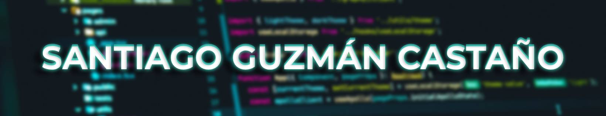

<h1 align="center">
  
</h1>

    
  

## &nbsp;Welcome! 

- 🧑‍🎓 I am a Systems Engineering student focused on growing as a developer and building solutions that make an impact.

- 💡 I’m passionate about programming, especially Frontend development and the power of Python for building and automation.

- 💻 I have an intermediate–advanced level in Python, and I am currently strengthening my skills in HTML and CSS, preparing to take the next step into web development.

- 📈 I’m constantly learning, always looking to improve and explore new technologies that bring me closer to professional opportunities.

- 🌟 My goal is to start working in the tech industry, contribute with my code, and keep growing as a developer.

## 📞 &nbsp;Contact

- 📱+57 3215958620
- 

## ⚡ &nbsp;Tech Stack

## 📊 &nbsp;Github Analytics

